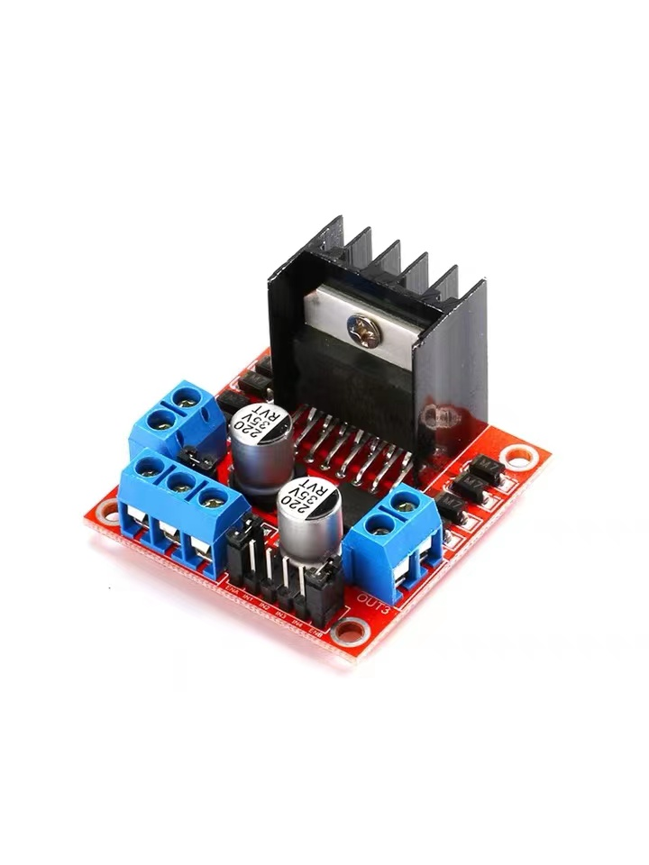
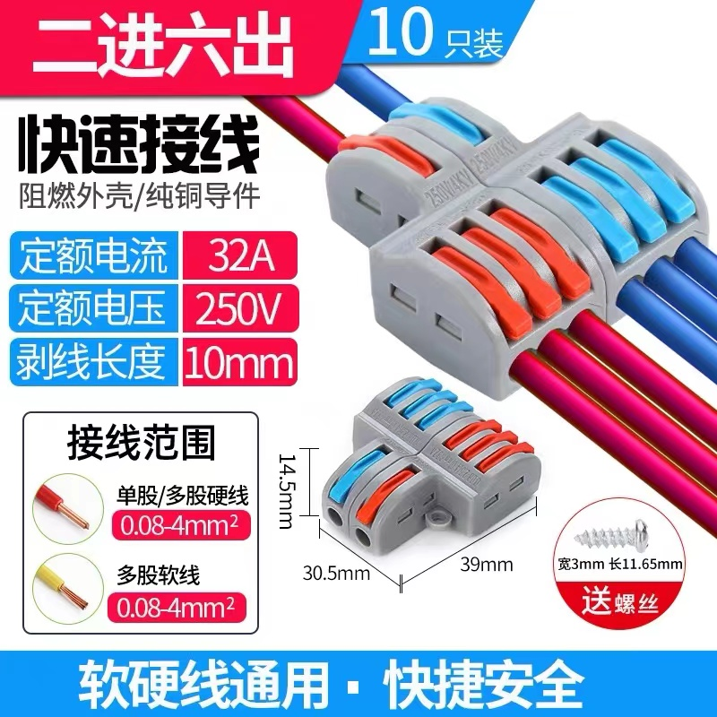
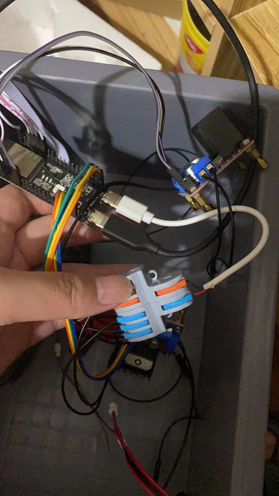

# FII CAR
 A remote control car control program, using `platformio` + `esp32s3` + `mcpwm` + `arduino` to achieve.
# 硬件
- [ESP32-S3-DevkitC-1](https://item.taobao.com/item.htm?spm=a312a.7700824.w4004-23558616519.7.71b7438bAl5xEP&id=709313615153)
- L298N

- 4 * 直流减速马达
- PS2 手柄 + 2.4G 无线模块
- 分线器

# 供电问题
> 使用两个 type-c 数据线, 一个连接充电宝, 一个通过分线器给 L298N + 马达供电
